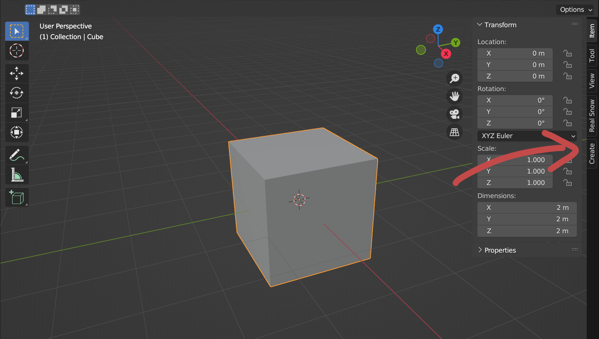
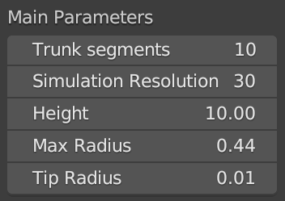
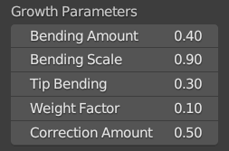
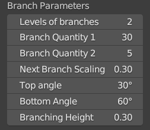
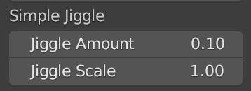
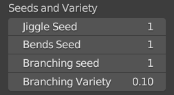
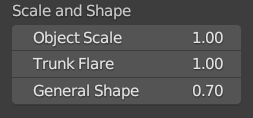

Features
==================================
Panel
---------
The addon is located in the **N-panel**, note that you have to be in object mode in order to access it.
Hit **create** and there is the **TreeGen panel**.

Operators
--------
There are multiple things you can do in TreeGen

* ``Create`` places a tree with all the parameters below on your ``cursor``.
   Adjusting parameters will automatically update the tree in realtime.
   If you feel like it's lagging a bit you can switch off faces, it might help.

* ``Sync`` synchronises the parameters in the panel with a tree you just happened to click on.

* ``Reset to defaults`` were you to mess those parameters quite a bit.

* ``Draw`` places a curve object and lets you edit it freely
   I encourage using **draw** mode in the toolbar on the left, but you can edit existing curve.
   After you feel like you're done, hit ``regrow``

Parameters
-----------
There are quite a bit of parameters but I believe they are quite intuitive.
If you hover a mouse over them, you will see simple descriptions.

Main
^^^^

* **Trunk segments** are the number of verts on the cross-section of the tree, it gets accorddingly lower on next branches
* **Simulation resolution** are the number of steps for algorithm and the number of verts alongside the trunk, significantly slows down simulation
* **Height** is self-explanatory
* **Max Radius** is absolute value, like Height
* **Tip radius** is the minimum radius a branch can have

..  rst-class::  clear-both

Growth
^^^^^^
this influences growth direction of all branches

* **Bending Amount** *primary effect* bends the tree according to noise
* **Bending Scale**  lets you change the scale of the noise
* **Tip Bending** acts like a will for the smallest branches to pull up to the sky
* **Weight Factor** *secondary effect* weighs down the whole tree, especially the branches, too much weight might lay your tree flat!
* **Correction Amount** think of it like post processing for straightening up a tree that bent too much

..  rst-class::  clear-both

Branch
^^^^^^

I won't be explaining all of these in details, they are quite self-explanatory.

* **Next Branch Scaling** scales down each branch in subsequent levels - 0.5 means branch of level 3 will have 0.25 of the original tree height
* **Top** and **Bottom angle** angle between the branch and local trunk direction
* **Branching Height** part of the tree at which the branching starts

..  rst-class::  clear-both

Simple Jiggle
^^^^^^^^^^^^^

**jiggle** is a noise that can help make branches and trunk be a little jagged and random, not intended to change direction like **bending**

..  rst-class::  clear-both

Seeds and Variety
^^^^^^^^^^^^^^^^^

Seeds are self-explanatory, **branch variety** affects branch length and angle. 
For example 0.1 means angles and lengths will can be lower or higher by 0.1 of their values

..  rst-class::  clear-both

Scale and Shape
^^^^^^^^^^^^^^

* **scale** changes the scale of the whole *mesh*, not object
* **Trunk Flare** can widen up the base a little bit, don't overdo it
* **General Shape** changes the length of branches according to their placement, I suggest playing with it.
   This setting can ultimately determine if you're making a pine tree or an apple tree.

..  rst-class::  clear-both

Advanced
^^^^^^^^

Lets the user select the leaf object.

..  rst-class::  clear-both